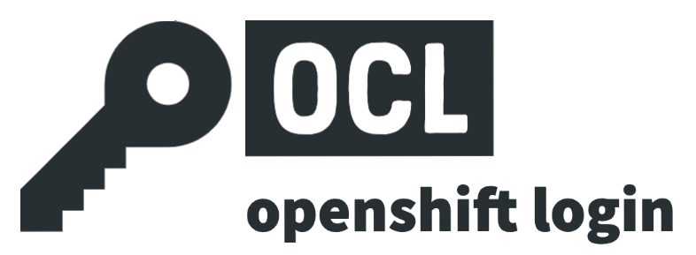

# OCL (OpenShift Login)

[][pypi-link]
[![PyPI platforms][pypi-platforms]][pypi-link]

[](https://github.com/chassing/ocl/actions/workflows/release.yaml)

OCL does an automatic login to an OpenShift cluster. It fetches cluster information from app-interface and performs a login via Red Hat SSO.

## Installation

You can install this tool from [PyPI][pypi-link] with `pip`:

```shell
python3 -m pip install openshift-cluster-login
```

or install it with `uv`:

```shell
uv tool install openshift-cluster-login
```

You can also use `uv` to run the tool without installing it:

```shell
uvx openshift-cluster-login
```

## Usage

```shell
ocl
```


This spawns a new shell with the following environment variables are set:

* `KUBECONFIG` - path to kubeconfig file
* `OCL_CLUSTER_NAME` - cluster name
* `OCL_CLUSTER_CONSOLE` - url to cluster console

## Features

OCL currently provides the following features (get help with `-h` or `--help`):

* OpenShift console login (`oc login`) via GitHub or Red Hat authentication
* Get cluster and namespace information from app-interface or user-defined (`OCL_USER_CLUSTERS`)
* Open the OpenShift console in  the browser (`--open-in-browser`)
* Star your most often used namespaces `Ctrl+S` in the UI
* Shell completion (`--install-completion`, `--show-completion`)
* Credentials via environment variables or shell command (e.g., [1password CLI](https://developer.1password.com/docs/cli/))
* Cache App-Interface queries (via GraphQL) for one week

## Environment Variables

| Variable Name                                       | Description                                                                                                                                 | Default |
| --------------------------------------------------- | ------------------------------------------------------------------------------------------------------------------------------------------- | ------- |
| OCL_APP_INTERFACE_URL OCL_APP_INTERFACE_URL_COMMAND | App-Interface URL                                                                                                                           |         |
| OCL_APP_INT_TOKEN OCL_APP_INT_TOKEN_COMMAND         | App-Interface authentication token [optional]                                                                                               |         |
| OCL_USER_CLUSTERS OCL_USER_CLUSTERS_COMMAND         | User defined clusters as json format (e.g. `[{"name": "local-kind", "serverUrl": "https://localhost:6443", "consoleUrl": "not available}]`) | "[]"    |
| OCL_CACHE_TIMEOUT_MINUTES                           | GraphQL cache timeout in minutes                                                                                                            | 1 hour  |
| OCL_HISTORY                                         | Enable/Disable the usage of the last selected namespace                                                                                     | enabled |
| OCL_CSS_PATH                                        | Path to custom Textual CSS file                                                                                                             |         |

You can either set a variable, e.g. `export OCL_GITHUB_USERNAME="mail@example.com"` or retrieve it via a command, e.g. `export OCL_GITHUB_USERNAME_COMMAND="op read op://Private/Github/username"`.
If a variable is not set but needed, OCL will ask for it interactively.

## App-Interface

OCL retrieves the cluster information from app-interface via GraphQL (`OCL_APP_INTERFACE_URL`) and caches them
in your user *cache directory* (on MacOS, e.g., `~/Library/Caches/ocl/gql_cache/`).
Remove this directory to force a refresh.

## Limitations

* Kerberos authentication only
* Works only with a Red Hat associate account

## Development

[](https://github.com/psf/black)
[](http://mypy-lang.org/)

[pypi-link]:                https://pypi.org/project/openshift-cluster-login/
[pypi-platforms]:           https://img.shields.io/pypi/pyversions/openshift-cluster-login
